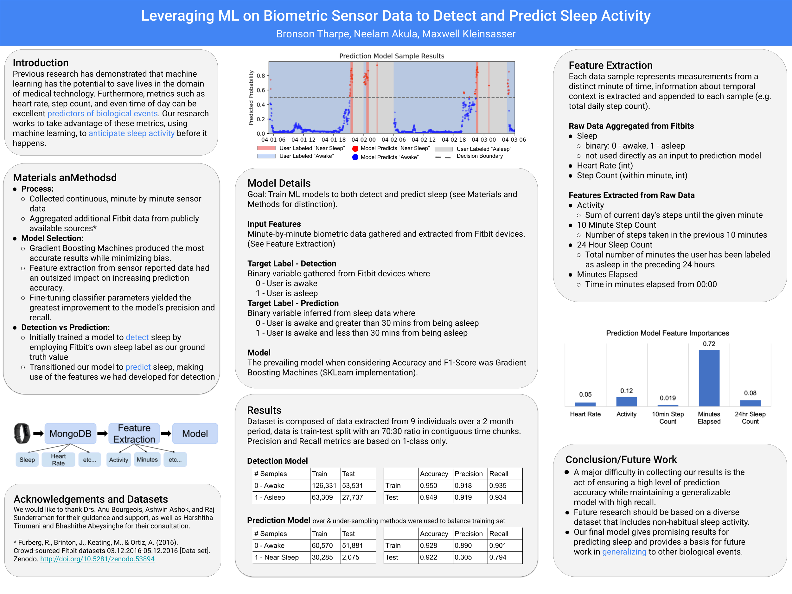

# Leveraging ML on Biometric Sensor Data to Detect and Predict Sleep Activity

This repository contains code developed by Max Kleinsasser, Neelam Akula, and Bronson Tharpe for a research project seeking to develop a framework for predicting biological events using wearable devices and machine learning algorithms. See "poster.png" for a summary of what was accomplished during this project.

To see the code used to collect and store biometric data from Fitbit and Samsung devices, see the Data Collection directory. To see the code used for modeling data gathered from wearables, see the Data Analysis directory.

